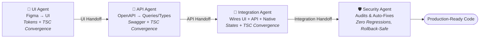

# React Native Agents

[](LICENSE)
[](https://reactnative.dev)
[](#-closed-loop-engineering-base)
[](CONTRIBUTING.md)

> A collection of specialized AI engineering agents that take a React Native feature from design to production-ready code — each one verifying its own output before handing off to the next.

Most AI coding agents generate code once and hope for the best. Every agent here runs an **in-loop validation cycle** — checking its own output against compiler gates, lint rules, and security analyzers — before it's allowed to declare a task complete. The result is a pipeline you can chain end-to-end, from Figma to a merged, audited pull request.

---

## 🚀 Quick Start

```bash
git clone https://github.com/avisek41/react-native-engineering-agent.git
cd react-native-engineering-agent
```

Open the agent directory you need and hand its `agent.md` (plus skills/rules) to your AI coding assistant, together with your React Native project:

```bash
cd agents/ui-agent/           # for UI work
cd agents/api-agent/          # for API work
cd agents/integration-agent/  # for data wiring & native modules
cd agents/security-agent/     # for security & audits
```

---

## Which Agent Should I Use?

| Agent                    | Use For                                                            | When to Reach For It                                          | Path                        |
| ------------------------ | ------------------------------------------------------------------ | ------------------------------------------------------------- | --------------------------- |
| 🎨 **UI Agent**          | Screens, components, layouts, design tokens, Figma translation     | Starting a new screen or component from a design              | `agents/ui-agent/`          |
| 🔌 **API Agent**         | OpenAPI/Swagger contracts, React Query hooks, mutations, API types | Wiring a screen to a backend endpoint                         | `agents/api-agent/`         |
| 🔄 **Integration Agent** | Screen coordinator hooks, DTO mappers, native modules, SDKs        | Connecting UI + API together, or adding a native SDK          | `agents/integration-agent/` |
| 🛡️ **Security Agent**    | OWASP MASVS compliance, secure storage, secret detection, audits   | Before merge, on a cron schedule, or during a security review | `agents/security-agent/`    |

> If a task crosses multiple areas, chain the agents in sequence (e.g., UI Agent → API Agent → Integration Agent). See [docs/agent-selection.md](docs/agent-selection.md) for details.

---

## Example Workflow

**Task:** _"Create a new profile screen and connect it to the profile API."_

1. **UI Agent** — scaffolds and implements the presentational screen from designs, emits a `UI Handoff` contract.
2. **API Agent** — inspects OpenAPI specs, discovers existing services, generates TanStack Query hooks, emits an `API Handoff` contract.
3. **Integration Agent** — generates the screen coordinator hook (`useProfileScreen.ts`) and DTO mapper to wire queries to the UI view model.

---

## 🔁 Closed-Loop Engineering Base

Every agent is architected around **Closed-Loop Engineering**: rather than generating unverified code from a single pass, each one iterates against compiler gates, strict lint rules, and security analyzers until it converges — then hands off a typed contract to the next agent in the chain.



### In-Loop Verification Gates per Agent

| Agent                    | In-Loop Self-Verification Checks                                                                                                                                                                                         | Closed-Loop Gate                                           |
| ------------------------ | ------------------------------------------------------------------------------------------------------------------------------------------------------------------------------------------------------------------------ | ---------------------------------------------------------- |
| 🎨 **UI Agent**          | Zero hardcoded hex colors / magic strings (`COLORS.*`, `STRINGS.*`) · Gluestack primitive enforcement & responsive layout checks · Local ViewModel contract validation                                                   | `npx tsc --noEmit`<br>`node ui-agent.js validate`          |
| 🔌 **API Agent**         | 100% parameter/response schema match with Swagger/OpenAPI · Zero-import pure TypeScript interfaces (`src/types/*.types.ts`) · Re-export verification in `types/index.ts` and `hooks/index.ts`                            | `npx tsc --noEmit`<br>`node api-agent.js validate`         |
| 🔄 **Integration Agent** | Zero direct HTTP/API calls inside JSX components · Complete state mapping: `isLoading`, `isError`, `isRefreshing`, `isEmpty` · Pagination & pull-to-refresh lifecycle verification                                       | `npx tsc --noEmit`<br>`node integration-agent.js validate` |
| 🛡️ **Security Agent**    | Static multi-level analysis (root, folder, file) across 8 domain packs · Heuristic false-positive suppression (skips comments, test mocks, `__DEV__`) · Safe auto-remediation with automatic rollback on compile failure | `security-agent.js`<br>`security-agent-ai.js --fix`        |

---

## Supported AI Coding Agents

Designed to work seamlessly with:

- **Antigravity**
- **Cursor**
- **Claude Code**
- **GitHub Copilot**
- **Codex / LLM CLI Tools**

Agent instructions are intentionally modular and tool-agnostic.

---

## Repository Structure

```
react-native-agents/
├── README.md                 # Main entry point & documentation
├── LICENSE                   # Open source license
├── CONTRIBUTING.md           # Guidelines for contributing new agents/rules
├── CHANGELOG.md              # Release history and updates
├── .gitignore                # Git ignore patterns
│
├── agents/
│   ├── ui-agent/             # Figma-to-code, Gluestack, components & screens
│   ├── api-agent/            # Swagger discovery, TanStack Query & API types
│   ├── integration-agent/    # Coordinator hooks, mappers & native SDKs
│   └── security-agent/       # Static security analyzer, MASVS & remediation
│
└── docs/
    ├── getting-started.md    # Quickstart guide
    ├── agent-selection.md    # Detailed guide on choosing the right agent
    └── usage.md              # Multi-agent workflows & IDE setups
```

Each agent contains its own instructions, skills, prompts, and supporting CLI tools.

---

## Roadmap

- [ ] AST-based static analysis for the Security Agent (Semgrep evaluation in progress)
- [ ] Versioned JSON schema output across all report generators
- [ ] Universal report generation usable across any project, not just React Native
- [ ] Expanded native SDK coverage for the Integration Agent

---

## Documentation

- [Getting Started Guide](docs/getting-started.md)
- [Agent Selection Guide](docs/agent-selection.md)
- [Multi-Agent Usage & Workflows](docs/usage.md)
- [Agent Capability & Verification Audit Report](docs/agent-verification-report.md)

---

## Contributing


To add or modify an agent, see [CONTRIBUTING.md](CONTRIBUTING.md).

## License

MIT
