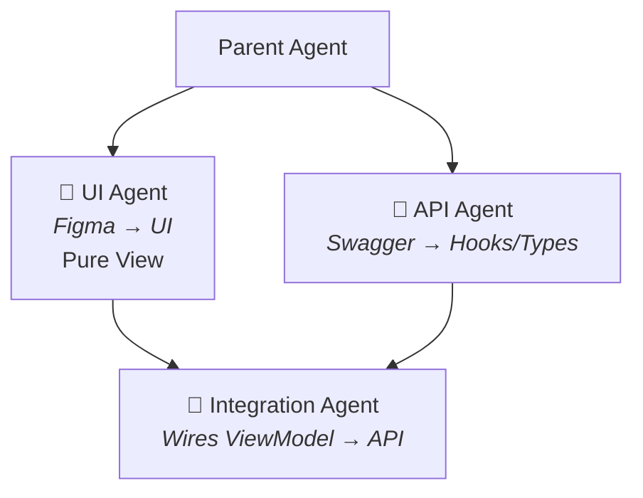

# UI Agent 🎨

[](../../LICENSE)
[](https://gluestack.io)
[](#-core-rules--invariants)
[](#architecture-philosophy)

> Part of the [React Native Agents](../../README.md) suite — pairs with the API, Integration, and Security agents.

**Figma to production-ready UI. Zero magic values.**

### Architecture Philosophy

> Built on **Closed-Loop Engineering** principles. The agent iteratively self-verifies generated UI against strict design tokens and the TypeScript compiler gate before emitting a stable handoff contract.

An enterprise-grade, standalone UI Implementation and Validation Agent for React Native & Gluestack UI applications (or your chosen UI library).

The **UI Agent** specializes in transforming Figma designs, wireframes, and UI requirements into production-quality, modular, tokenized, and type-safe React Native screens and components — completely isolated from network/API dependencies.

---

## 📦 Directory Overview

<details>
<summary>Click to expand full directory tree</summary>

```
ui-agent/
├── agent.md                        # Cursor / AI Agent system prompt
├── README.md                       # Comprehensive agent documentation
├── UI_AGENT_ARCHITECTURE.md        # Architecture, workflows & boundary rules
├── package.json                    # Standalone package definition
├── ui-agent.config.example.json    # Static validator & scaffolder configuration
├── ui-agent.js                     # CLI tool for UI validation & scaffolding
│
├── commands/                       # AI Agent / Cursor Commands
│   ├── build-screen.md             # Scaffold & build presentational screen
│   ├── build-component.md          # Scaffold reusable UI component
│   ├── review-ui.md                # Audit UI code for token compliance
│   └── fix-ui-lint.md              # In-loop automated fixing of UI violations
│
├── skills/                         # Agent Skills & Domain Guides
│   ├── ui-implementation/
│   │   ├── SKILL.md                # Step-by-step UI implementation protocol
│   │   └── reference.md            # Design tokens, Gluestack mappings & patterns
│   ├── figma-to-rn/
│   │   └── SKILL.md                # Figma AST / Auto-layout translation protocol
│   └── component-generator/
│       └── SKILL.md                # Component scaffolding and structure guide
│
├── rules/                          # Strict Engineering Guidelines (.mdc)
│   ├── ui-component-standards.mdc  # Gluestack priority, token enforcement & imports
│   ├── no-hardcoded-values.mdc     # Zero magic numbers, strings, or hex colors
│   └── closed-loop-ui.mdc          # Self-healing loop & compiler validation
│
├── templates/                      # Component & Screen Boilerplates
│   ├── ScreenTemplate.tsx          # Clean screen template
│   ├── ComponentTemplate.tsx       # Reusable component template
│   ├── TypesTemplate.ts            # Screen-local view-model template
│   └── StringsTemplate.ts          # Localization strings template
│
└── lib/                            # CLI Engine & Analyzers
    ├── constants.js                # Token regexes, forbidden imports, severity
    ├── validator.js                # Static scanner (AST + Regex)
    ├── scaffolder.js               # Code generator for screens & components
    └── reporter.js                 # Terminal & Markdown report generator
```

</details>

---

## 🚀 Quick Start & CLI Tools

The UI Agent includes an integrated CLI scanner and scaffolding engine.

### 1. Validate UI Code Compliance

Scan files or directories for zero-magic-values, Gluestack usage, and forbidden API hooks:

```bash
# Validate entire UI src directory
node ui-agent/ui-agent.js validate ./src

# Validate screens only
node ui-agent/ui-agent.js validate ./src/screens

# Validate components only
node ui-agent/ui-agent.js validate ./src/components

# Validate single file
node ui-agent/ui-agent.js validate ./src/screens/Main/HomeScreen/HomeScreen.tsx
```

### 2. Scaffold New Screen or Component

Use the built-in generator to create standardized boilerplate:

```bash
# Scaffold a new screen
node ui-agent/ui-agent.js scaffold screen PlayerProfile --stack Main

# Scaffold a reusable UI primitive
node ui-agent/ui-agent.js scaffold component RatingBadge
```

---

## 🎯 Separation of Concerns



| Responsibility               |   UI Agent   |  API Agent   | Integration Agent |
| ---------------------------- | :----------: | :----------: | :---------------: |
| Figma / Layout Parsing       | ✅ **Owner** |      ❌      |        ❌         |
| Gluestack & Tokens           | ✅ **Owner** |      ❌      |        ❌         |
| Screen-local ViewModels      | ✅ **Owner** |      ❌      |        ❌         |
| API Services & Queries       |      ❌      | ✅ **Owner** |        ❌         |
| `use{Screen}Screen.ts` Hook  |      ❌      |      ❌      |   ✅ **Owner**    |
| Data Wiring & Error Handling |      ❌      |      ❌      |   ✅ **Owner**    |

---

## 🛡️ Core Rules & Invariants

#### Tokens & Strings

1. **Zero Hardcoded Colors**: All colors must use `COLORS.*` design tokens from `@theme/color.ts` (never `#ffffff`, `rgba()`, etc.).
2. **Zero Hardcoded Strings**: All user-visible labels, headers, placeholders, and button texts must come from `STRINGS.*` in `src/constant/strings/`.

#### Component Structure

3. **Gluestack Primitives**: Use `<VStack>`, `<HStack>`, `<Box>`, `<ScreenContainer>`, `<CardContainer>` instead of raw un-styled `View` (or the equivalent primitives if you're using a different UI library).
4. **Screen-Local ViewModels**: Screen components and cards must consume screen-local interfaces defined in `types.ts`, never raw backend DTOs.
5. **High-Performance Lists**: Use `LegendList` from `@legendapp/list` for dynamic/paginated lists; reserve `ScrollView` + `.map()` only for static lists $\le 8$ items.
6. **TestID Tagging**: Every interactive element (button, input, list item, modal, tab) must have a kebab-case `testID`.
7. **Modular Hierarchy**: Place screen-specific components under `src/screens/{Stack}/{Screen}/Components/`. Promote to `src/components/ui/` only when shared across 2+ screens.

#### Boundaries & Quality Gates

8. **Never Touch API / Networking**: No `useQuery`, `useMutation`, `axios`, `fetch`, or coordinator hooks (`useXxxScreen.ts`).
9. **Compiler & Gate Convergence**: Must pass `npx tsc --noEmit` and `node ui-agent.js validate` before emitting the UI Handoff contract.

---

## 💡 Real-World Example & Walkthrough

<details>
<summary>Scenario: Building a Player Profile Screen from Figma — click to expand</summary>

### Step 1: User Input

The engineer or product manager provides a Figma frame or screenshot:

```markdown
Figma URL: https://www.figma.com/design/AbCdEf12345/SportsApp?node-id=204-189
Requirement: "Scaffold the PlayerProfileScreen. Needs header with avatar, name, rank badge,
stats card (win rate, total games), and recent matches list. Use Gluestack UI and tokens."
```

### Step 2: UI Agent Workflow

1. Inspects the Figma design node to extract layout hierarchy, padding, typography, and color tokens.
2. Translates layout to Gluestack primitives:
   - Screen Container → `<VStack flex={1} bg="$backgroundDark950">`
   - Header & Stats → `<HStack justifyContent="space-between">`
3. Extracts all hardcoded strings into `src/constant/strings/playerProfile.strings.ts`.
4. Maps colors to `@theme/color.ts` tokens (`COLORS.primary`, `COLORS.surfaceCard`).
5. Generates the screen-local ViewModel interface in `types.ts`.
6. Executes `npx tsc --noEmit` and the built-in validator:
   ```bash
   node agents/ui-agent/ui-agent.js validate ./src/screens/Main/PlayerProfileScreen
   ```

### Step 3: Generated UI Handoff Contract

The agent presents the created files and returns the contract for the next agent:

```yaml
## UI Handoff
status: created
screenFile: src/screens/Main/PlayerProfileScreen/PlayerProfileScreen.tsx
viewModel: |
  export interface PlayerProfileProps {
    player: { id: string; name: string; avatarUrl: string; rank: string };
    stats: { winRate: number; totalGames: number; mvpCount: number };
    recentMatches: Array<{ id: string; opponent: string; score: string; isWin: boolean }>;
  }
requiredApiData:
  - GET /mobile/players/:playerId/profile
  - GET /mobile/players/:playerId/matches
components:
  - src/screens/Main/PlayerProfileScreen/Components/StatsCard.tsx
  - src/screens/Main/PlayerProfileScreen/Components/MatchHistoryItem.tsx
stringsModule: STRINGS.PLAYER_PROFILE
figmaFieldsWithoutApi: []
placeholders: none
navigationChanged: true
notes: "All components tokenized. Ready for API agent integration."
```

</details>

---

## 🛠️ Exporting as a Standalone Git Repository

This `ui-agent` directory is completely self-contained. To publish it as a standalone repository:

```bash
cd agents/ui-agent
git init
git add .
git commit -m "feat: initial ui-agent release"
git remote add origin <YOUR_GIT_REPO_URL>
git push -u origin main
```
