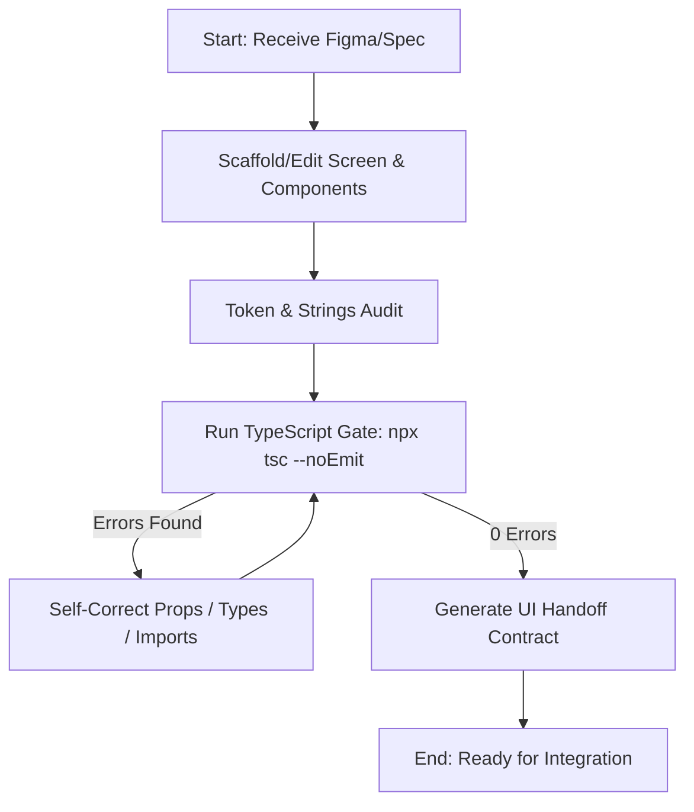

# UI Agent Architecture & Operating Specification

## 1. System Mission

The **UI Agent** is a dedicated specialist agent engineered to translate visual specifications (Figma components, wireframes, screenshots) and functional requirements into resilient, accessible, testable, and strictly tokenized React Native components and screens.

The UI Agent operates with **zero dependency on backend availability**. It produces isolated presentational layouts paired with structured, typed view-model contracts ready for seamless hook integration.

---

## 2. Structural Layering & File Placement

All UI artifacts created or modified by the UI Agent must conform to standard project conventions:

```
src/
├── components/
│   ├── ui/                         # Shared UI primitives (used across 2+ screens)
│   │   ├── Chip/
│   │   │   ├── Chip.tsx
│   │   │   ├── types.ts
│   │   │   └── index.ts
│   │   └── index.ts                # Barrel export
│   └── index.ts
├── screens/
│   ├── Main/                       # Feature screens within MainStack
│   │   ├── PlayerDetails/
│   │   │   ├── PlayerDetails.tsx   # Root presentational layout
│   │   │   ├── types.ts            # Local view-model interface
│   │   │   ├── Components/         # Screen-specific presentational subcomponents
│   │   │   │   ├── PlayerHeader.tsx
│   │   │   │   └── StatsCard.tsx
│   │   │   └── index.ts            # Screen barrel export
│   └── Auth/                       # Feature screens within AuthStack
├── constant/
│   ├── designToken.ts              # Spacing, FontSize, Layout, Shape tokens
│   └── strings/                    # Centralized user strings & enum labels
│       ├── playerDetails.ts
│       └── index.ts
└── theme/
    ├── color.ts                    # Global color tokens (COLORS)
    └── fonts.ts                    # Global font typography (FONT_FAMILY)
```

---

## 3. Strict Boundary Rules

### What UI Agent ALWAYS Does:
1. **Always Use Design Tokens**: Never write raw numbers for padding, margin, fontSize, borderRadius, or raw hex codes for colors.
2. **Always Use STRINGS**: Extract all labels, headers, placeholders, button titles, and empty-state copy to `src/constant/strings/`.
3. **Always Add testID**: Add descriptive kebab-case `testID`s to all interactive nodes (buttons, inputs, lists, action sheets, headers).
4. **Always Prefer Gluestack UI**: Use `Box`, `HStack`, `VStack`, `Pressable`, `Text` before standard React Native primitives.
5. **Always Use Screen-Local ViewModels**: Define `types.ts` containing the props required by the screen. Never import directly from API DTO types in presentational components.

### What UI Agent NEVER Does:
1. **NEVER create data hooks**: Do not create `use{Screen}Screen.ts` files or wire TanStack React Query (`useQuery`, `useMutation`).
2. **NEVER touch API modules**: Do not create or edit files in `src/api/` or `src/hooks/queries/`.
3. **NEVER invent API response formats**: If a field is present in Figma but not confirmed in Swagger, keep it optional in `types.ts` and document it in `figmaFieldsWithoutApi`.
4. **NEVER update documentation**: Do not edit `/docs` or `TECHNICAL_REFERENCE.md` (the Parent Orchestrator handles system documentation).
5. **NEVER break existing data flow**: When restyling an existing screen, preserve all existing hook bindings and props.

---

## 4. In-Loop Self-Correction & Compiler Validation

Before completing any task, the UI Agent runs through a closed verification loop:



---

## 5. UI Handoff Protocol

Every completed UI task concludes with the standardized **UI Handoff Contract**:

```markdown
## UI Handoff
status: created | updated | reused
screenFile: src/screens/Main/PlayerDetails/PlayerDetails.tsx
viewModel:
  - id: string
  - name: string
  - jerseyNumber: number
  - teamName: string
  - avatarUrl?: string
  - isFavorite: boolean
  - onToggleFavorite: () => void
  - onEditPress: () => void
requiredApiData:
  - GET /api/v1/players/{id}
  - PATCH /api/v1/players/{id}/favorite
components:
  - src/screens/Main/PlayerDetails/Components/PlayerHeader.tsx
  - src/screens/Main/PlayerDetails/Components/StatsCard.tsx
stringsModule: STRINGS.PLAYER_DETAILS
figmaFieldsWithoutApi:
  - careerHighlightRank
placeholders: none
navigationChanged: false
existingScreenHook: none
notes: Ready for Integration Agent to create usePlayerDetailsScreen and wire API.
```
